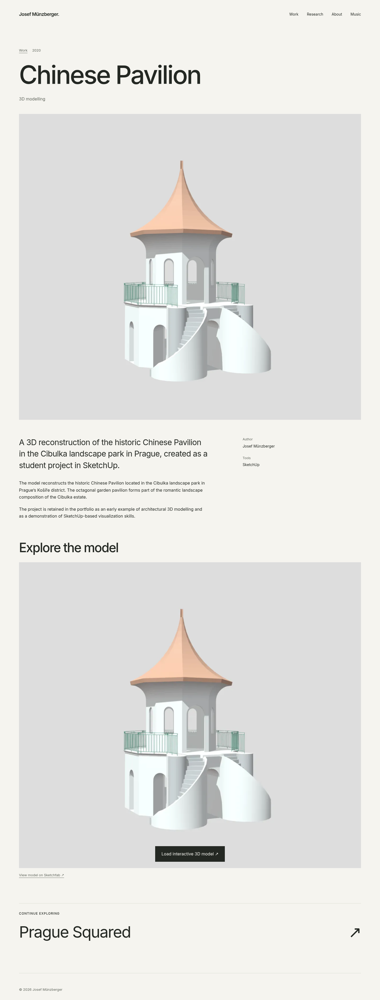
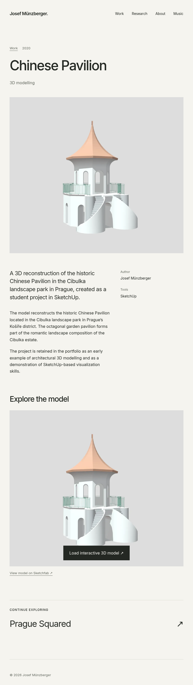
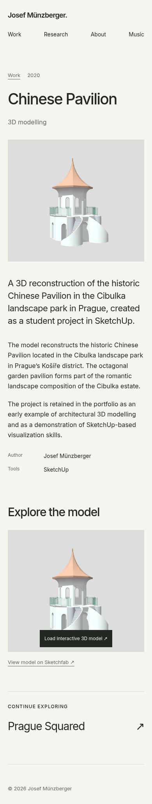

# Chinese Pavilion — vizuální review 3

[← Přehled všech stránek](README.md) · [Samostatné project cards](cards/README.md)

Třetí iterace podle [Round 3 change requestu](../REDESIGN_CHANGE_REQUEST_ROUND3.md). Všechny snímky jsou full-page, DPR 1. Originály jsme při implementaci neupravovali; aktuální podklady zahrnují také soubory dodané či nahrazené upstream.

## Desktop — 1440 px

[Otevřít PNG v plné velikosti](desktop/13-chinese-pavilion-cibulka.png)

## Tablet — 768 px

[Otevřít PNG v plné velikosti](tablet/13-chinese-pavilion-cibulka.png)

## Mobile — 390 px

[Otevřít PNG v plné velikosti](mobile/13-chinese-pavilion-cibulka.png)

