# Project cards — kurátorské review 3

[← Všechny full-page screenshoty](../README.md)

Všech 11 projektů, **desktop + mobile**. Každý PNG je přímý screenshot celé karty: cover se skutečným CSS cropem, název, category/subtitle a rok. Originály jsme při implementaci neupravovali; nové či nahrazené podklady dodané upstream jsou součástí aktuálního buildu.

Desktopové karty jsou zachycené při viewportu **1440 px**, mobilní při **390 px**. Skutečná šířka karty je menší než viewport a liší se podle featured / secondary gridu. Tabulka níže náhledy pouze přizpůsobuje šířce GitHubu — pro posouzení přesného měřítka použij PNG nebo full-page screenshot.

## Desktop — porovnání vedle sebe

| | | |
|---|---|---|
| [**Prague Squared**](desktop/prague-squared.png) 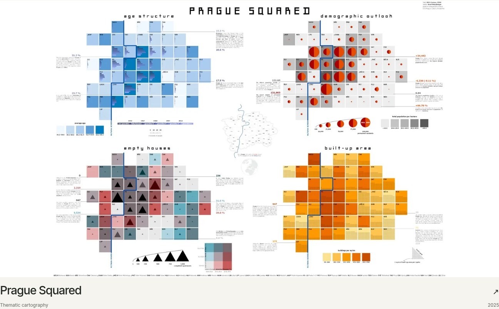 | [**Joy Plots**](desktop/joyplot.png) 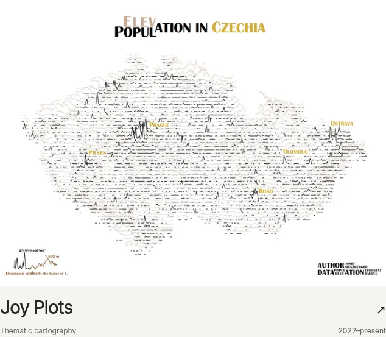 | [**Dante’s Inferno**](desktop/dantes-inferno.png) 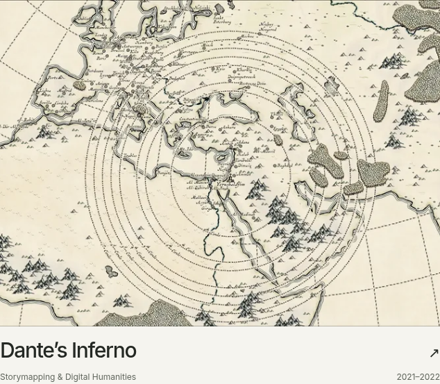 |
| [**Tropical Nights**](desktop/tropical-nights.png) 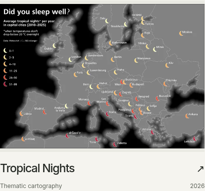 | [**The Beatles Map**](desktop/the-beatles-map.png) 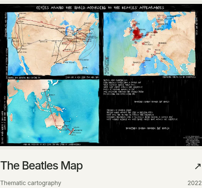 | [**Elton John Farewell Tour**](desktop/elton-john-tour.png) 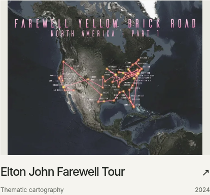 |
| [**Chinese Pavilion**](desktop/chinese-pavilion-cibulka.png) 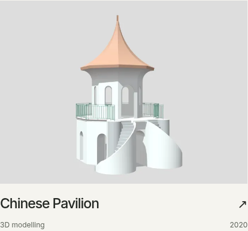 | [**Bivariate Joy Plots**](desktop/bivariate-joyplot.png) 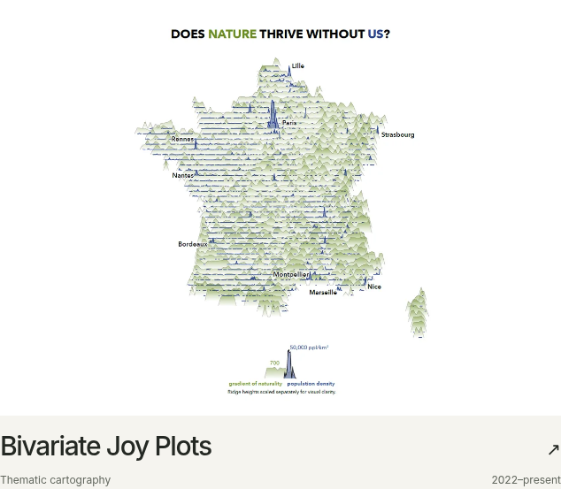 | [**Beyond the Horizon**](desktop/beyond-the-horizon.png) 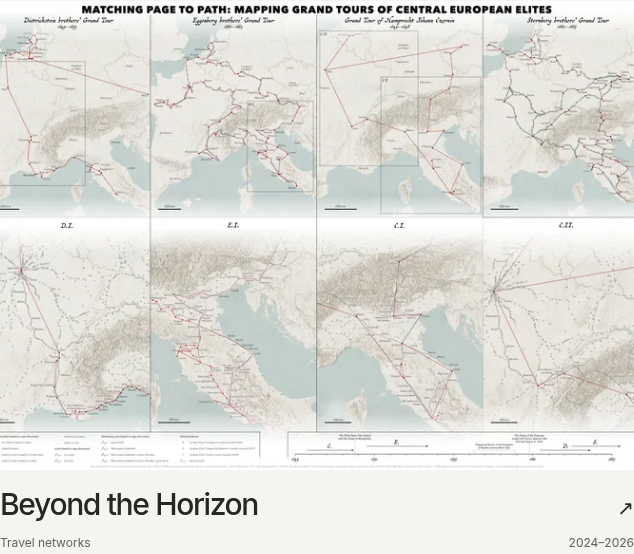 |
| [**The Second Life of the Chain Bridge**](desktop/vltava-ii.png) 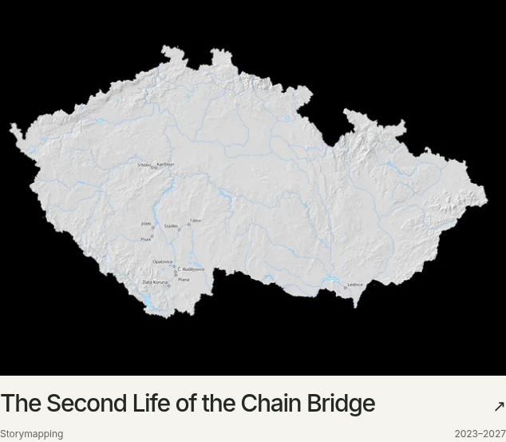 | [**Tracing the Lost Railway**](desktop/two-centuries-of-railways.png) 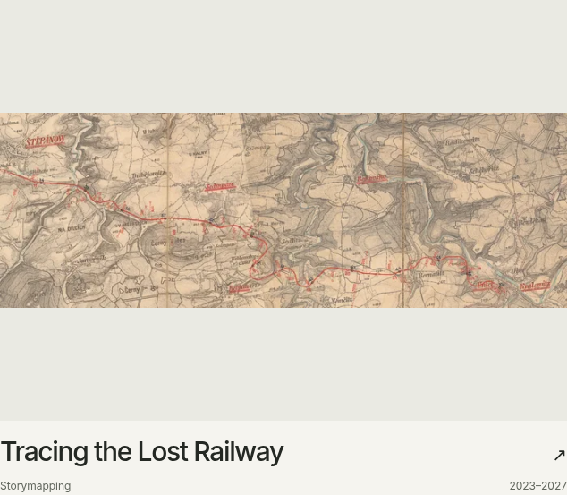 |   |

## Nativní snímky a kontext

| Projekt | Listing | Desktop PNG | Mobile PNG |
|---|---|---|---|
| Prague Squared | /work/ | [PNG](desktop/prague-squared.png) | [PNG](mobile/prague-squared.png) |
| Joy Plots | /work/ | [PNG](desktop/joyplot.png) | [PNG](mobile/joyplot.png) |
| Dante’s Inferno | /work/ | [PNG](desktop/dantes-inferno.png) | [PNG](mobile/dantes-inferno.png) |
| Tropical Nights | /work/ | [PNG](desktop/tropical-nights.png) | [PNG](mobile/tropical-nights.png) |
| The Beatles Map | /work/ | [PNG](desktop/the-beatles-map.png) | [PNG](mobile/the-beatles-map.png) |
| Elton John Farewell Tour | /work/ | [PNG](desktop/elton-john-tour.png) | [PNG](mobile/elton-john-tour.png) |
| Chinese Pavilion | /work/ | [PNG](desktop/chinese-pavilion-cibulka.png) | [PNG](mobile/chinese-pavilion-cibulka.png) |
| Bivariate Joy Plots | /research/ | [PNG](desktop/bivariate-joyplot.png) | [PNG](mobile/bivariate-joyplot.png) |
| Beyond the Horizon | /research/ | [PNG](desktop/beyond-the-horizon.png) | [PNG](mobile/beyond-the-horizon.png) |
| The Second Life of the Chain Bridge | /research/ | [PNG](desktop/vltava-ii.png) | [PNG](mobile/vltava-ii.png) |
| Tracing the Lost Railway | /research/ | [PNG](desktop/two-centuries-of-railways.png) | [PNG](mobile/two-centuries-of-railways.png) |

Prague Squared je zde jednou, z featured gridu Work. Jeho menší varianta v Research je vidět na full-page snímcích Research. Karty ostatních Work projektů pocházejí z Work; poslední čtyři z Research. Homepage compact varianty jsou zdokumentované na snímcích Home. Žádný projekt není kvůli získání screenshotu přemísťován do umělého gridu.

Round 3 zkracuje kartu na **Elton John Farewell Tour** a titul na **Chinese Pavilion**. Research listing je řazen podle počátečního roku sestupně; pořadí této porovnávací tabulky není pořadím Research gridu. Covery ani CSS cropy nebyly v této iteraci svévolně měněny; upstream mohl dodat nové či nahrazené zdrojové soubory. Přesné rozměry zachycených PNG jsou v `../manifest.json`.
