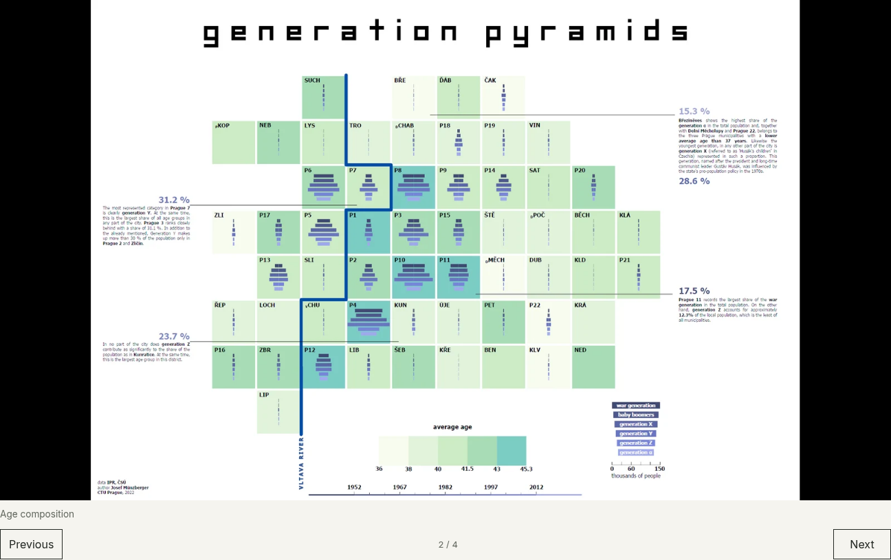
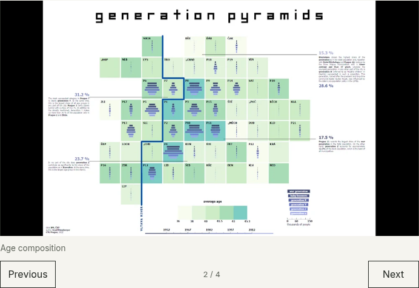
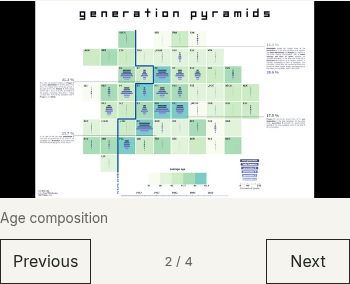
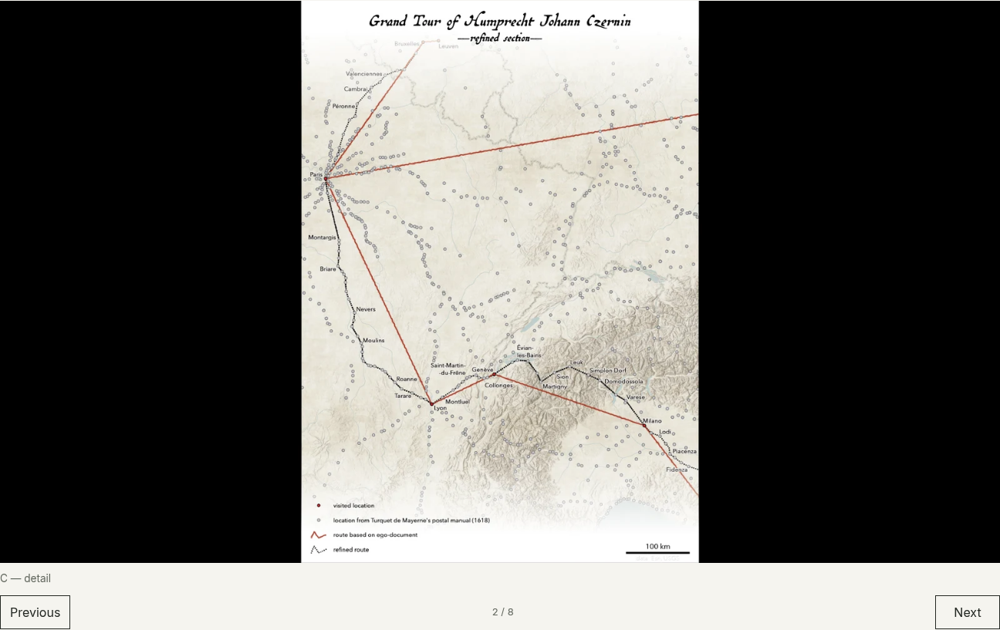
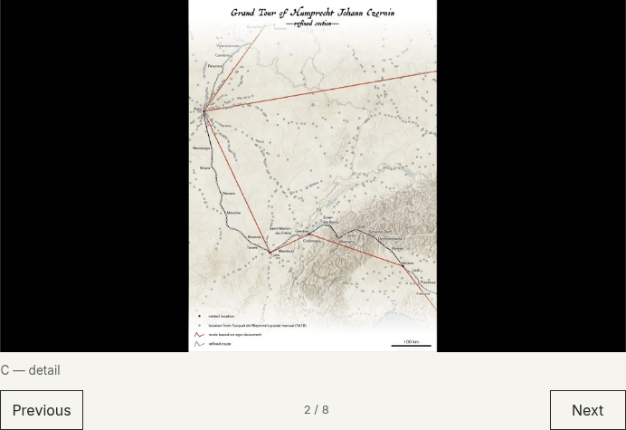
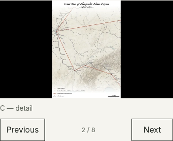

# Prezentační galerie — vizuální review 3

[← Přehled všech stránek](../README.md) · [Round 3 change request](../../REDESIGN_CHANGE_REQUEST_ROUND3.md)

Doplňkové snímky zachycují **aktivní druhou mapu** po použití ovládání galerie. Oba projekty používají jedno prezentační okno; nejde o svislý seznam obrázků. Celkem šest PNG, DPR 1.

| Projekt | Desktop · 1440 px | Tablet · 768 px | Mobile · 390 px |
|---|---|---|---|
| [Prague Squared](../06-prague-squared.md) | [PNG](desktop/prague-squared.png) | [PNG](tablet/prague-squared.png) | [PNG](mobile/prague-squared.png) |
| [Beyond the Horizon](../14-beyond-the-horizon.md) | [PNG](desktop/beyond-the-horizon.png) | [PNG](tablet/beyond-the-horizon.png) | [PNG](mobile/beyond-the-horizon.png) |

## Prague Squared — druhý snímek

## Beyond the Horizon — druhý snímek

Při review zkontroluj ovládání Previous / Next, počitadlo a contain zobrazení map. Statické PNG nenahrazují test klávesnice ani interakce; výsledky technického QA jsou v [reportu](../../REDESIGN_ROUND3_REPORT.md).
